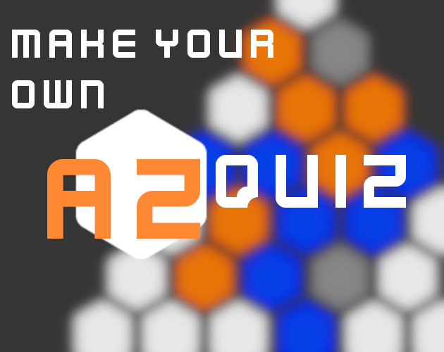

# M.Y.O. AZ Quiz

*Make your very own AZ Quiz, as seen on TV.*

[License](https://github.com/FTEdianiaK/M.Y.O.-AZ-Quiz/blob/main/LICENSE) | [Asset License](https://creativecommons.org/publicdomain/zero/1.0/)

### Features

### How to...
 

**Play:**
- Visit my [Itch](https://edianiak.itch.io/lm) for more information.

**Re-code:**
- Grab a zip of the whole repository using the 'Code' button above.
- Alternatively, use 'git clone'.
- Open using [Godot](https://godotengine.org/).

### Known Bugs
- None yet... Report them [here](https://github.com/FTEdianiaK/library-parrotex/issues).

### Credits

**Engine:** [Godot - by Godot Engine - MIT](https://godotengine.org/)

**Assets:** [by Kenney - CC0](https://kenney.nl/assets)

**Inspiration:** [AZ Quiz - by Czech Television](https://www.ceskatelevize.cz/porady/1097147804-az-kviz/)
